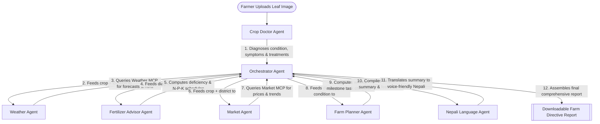

# AgriSathi AI - Agent Flow Documentation

This document describes the autonomous "Antigravity Workflow" execution chain of the AgriSathi AI agricultural platform.

---

## 1. Flow Diagram

---

## 2. Step-by-Step Chaining Walkthrough

### Step 1: User Upload / Symptom Input
The user uploads an image of a diseased crop leaf (e.g. Tomato Late Blight leaf spots) on the Crop Doctor tab and triggers the autonomous chain.

### Step 2: Crop Doctor Agent Diagnostic
The Orchestrator routes the image to the **Crop Doctor Agent**. The Crop Doctor invokes the `diagnosis_skill` (which checks the image via Gemini Vision or matches symptoms in the SQLite Knowledge database) to determine:
- Crop: Tomato
- Condition: Late Blight
- Symptoms: Dark spots with concentric target rings and yellow margins.
- Treatments: Organic Bordeaux mixture, preventative spacing, and restricted chemical controls (Chlorothalonil).

### Step 3: Weather Assessment
The Orchestrator takes the location (e.g. Kathmandu) and the diagnosed disease and sends it to the **Weather Agent**. The Weather Agent:
- Queries the Weather MCP tool to retrieve the 7-day forecast.
- Identifies environmental risk parameters (e.g. humidity >85% and temperatures around 22°C support Late Blight pathogen multiplication).
- Alerts the Orchestrator that weather conditions pose a **Critical Fungal Spread Risk**, requiring reduced overhead irrigation.

### Step 4: Fertilizer Formulation
The Orchestrator passes the diagnosed crop and disease state to the **Fertilizer Advisor Agent**. The Fertilizer Agent:
- Detects that Late Blight causes calcium transport restriction.
- Formulates a custom application schedule: Avoid high nitrogen (which makes leaves soft and susceptible) and apply Calcium Nitrate foliar spray to strengthen leaf cell walls.
- Recommends sustainable bio-fertilizers (compost tea).

### Step 5: Market Opportunity Projections
The Orchestrator routes the crop name and district to the **Market Intelligence Agent**. The Market Agent:
- Connects to the Market MCP tool to query current market prices across Jhapa, Kathmandu, and Pokhara.
- Analyzes the historical 12-month trend for the crop.
- Returns current pricing (e.g., NPR 75.0/kg avg) and issues a sell-versus-hold opportunity directive (e.g., "Sell Now: Current price is near historical peak of NPR 80/kg").

### Step 6: Calendar Checklist Generation
The Orchestrator routes the diagnosed condition to the **Farm Planner Agent**. The Farm Planner:
- Compiles a 4-week recovery milestone checklist (Week 1: Pruning/fungicide spray; Week 2: Bottom-leaf cleaning; Week 3: Foliar calcium; Week 4: Crop rotation mapping).
- Exports this checklist structure.

### Step 7: Localization & Translation
The Orchestrator aggregates the details into an executive summary and sends it to the **Nepali Language Agent**. The Nepali Agent:
- Translates the text into simplified, polite, and encouraging Nepali language so it can be read aloud to smallholder farmers (e.g. Golbheda, Dadhuwa Rog, Moolya, and Saptahik Yojana).

### Step 8: Consolidation & Presentation
The Orchestrator compiles all sub-agent responses into a single comprehensive Markdown farm directive report, updates the active UI dashboard tabs (Insights, Calendar), and logs the action in the database.
